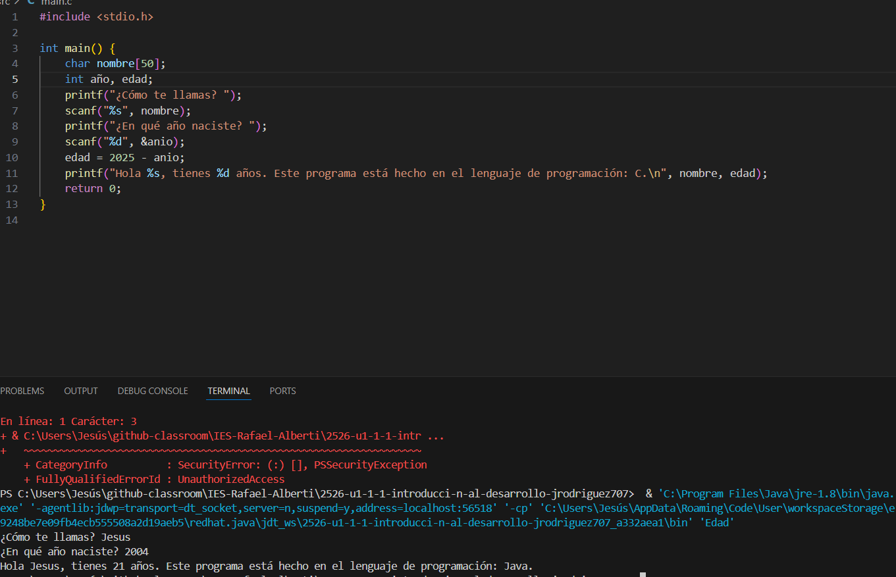

[](https://classroom.github.com/a/F4zkDqTW)
[](https://classroom.github.com/online_ide?assignment_repo_id=21094883&assignment_repo_type=AssignmentRepo)
# Práctica 2: Introducción al desarrollo. Ponlo en práctica.

Apoyate en los siguientes recursos para realizar la práctica:

[Descripción de la práctica](https://revilofe.github.io/section3/u01/practica/EDES-U1.-Practica011/)


---

# Título de la Actividad

## Identificación de la Actividad
- **ID de la Actividad:** [Practica 2]
- **Módulo:** [EDES]
- **Unidad de Trabajo:** [Número y nombre de la unidad de trabajo]
- **Fecha de Creación:** [16/10/2025]
- **Fecha de Entrega:** [16/10/2025]
- **Alumno(s):** 
  - **Nombre y Apellidos:** [Jesús Rodríguez Rodríguez]
  - **Correo electrónico:** [jrodrod679@g.educaand.es]
  - **Iniciales del Alumno/Grupo:** [JRR]

## Descripción de la Actividad
[El propósito de esta práctica es entender cómo los lenguajes de programación se relacionan con el hardware, categorizar los lenguajes en tres lenguajes diferentes: interpretados, compilados y con máquina virtual y conocer la forma de estos son ejecutados en términos de compilación, interpretación o ejecución a través de máquinas virtuales. Para lograr eso, los análisis son tres programas equivalentes escritos en Python, C y Java, que preguntan al usuario cuál es su prednombre, qué año de nacimiento posee y muestra esa salida:
“Hola [nombre], tienes [x] años. Este programa está hecho en el lenguaje de programación: [lenguaje].”]

## Instrucciones de Compilación y Ejecución
1. **Requisitos Previos:**
   - [Lenguajes:
   - Python 3.7
   - GCC 15.2 (C, compilado)
   - Spring boot extension pack?
   ]
   - [Visual Studio Code]

2. **Pasos para Compilar el Código:**
   ```bash
   [python main.py]
   ```

3. **Pasos para Ejecutar el Código:**
   ```bash
   [gcc main.c]
   ```

4. **Ejecución de Pruebas:**
   ```bash
   [javac main.java]
   ```

## Desarrollo de la Actividad
### Descripción del Desarrollo
[]

### Código Fuente
[`src/main.java`
`src/main.py`
`src/main.c`]

### Ejemplos de Ejecución
- **Entrada 1:** Descripción de la entrada y valor de prueba.
- **Salida Esperada 1:** Explicación de la salida esperada y el resultado de la prueba.

### Resultados de Pruebas
[-> java
]

## Documentación Adicional
- **Manual de Usuario:** [Enlace a la documentación del usuario, si existe]
- **Autorización de Permisos:** Verificar que el profesor tenga permisos de lectura en el repositorio para revisar el código.

## Conclusiones
[No me vuelvo a quejar de python, ya que es el más fácil que he visto, C es complejo pero más rápido, y java combina portabilidad y buen rendimiento.]

## Referencias y Fuentes
[Para python:https://www.youtube.com/watch?v=Kp4Mvapo5kc&list=PLNdFk2_brsRdgQXLIlKBXQDeRf3qvXVU_ es una lista para aprender python de moura dev
Para  java: https://www.youtube.com/watch?v=W86KTBSiX2o&pp=ygUObW91cmEgZGV2IGphdmE%3D tambien es un curso de moura dev
Para c:  https://www.youtube.com/watch?v=wk930KiQJU8&list=PLg9145ptuAig7vzvLMYBssAzSjhnGaRmQ&pp=0gcJCaIEOCosWNin este es de otro canal ]

### Notas Adicionales:
1. **Nombres de Archivos y Repositorios:**
   - Asegúrate de que el nombre del archivo o repositorio siga la estructura definida: `XXX-idActividad-Iniciales`.
2. **Permisos:**
   - Verifica que el profesor tenga los permisos necesarios para acceder al repositorio o documento.
3. **Formato:**
   - Si se entrega en formato PDF o Google Docs, asegúrate de cumplir con el mínimo y máximo de folios establecidos.
4. **Compilación y Ejecución:**
   - Detalla claramente cómo compilar y ejecutar el código, incluyendo las instrucciones en el archivo `README.md`.
